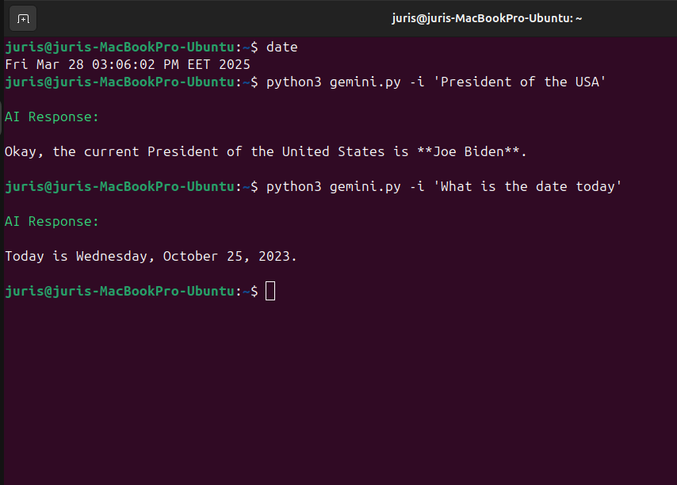

# gemini-ai-bash-assistant
  Gemini-AI assistant for automation via bash/python and nice prompt/output in any *nix terminal.
 Almost 'headless' near 'lazy' installation. With <b>no-selenium</b>, <b>no-chrome-driver</b>, no by-passes or other tricky manipulations.
  For complex coding, Gemini offers a clear advantage in accuracy and efficiency, way more excels ChatGPT or DeepSeek.
 
 This tool has to help with automation, real-time event detection, making it highly effective for log monitoring and system alert generation.
   Requirments:
    Linux or 
    FreeBSD or
    Termux and
    Python
    (will to install some python modules).
 Usage:
 git clone https://github.com/jusis707/gemini-ai-bash-assistant
 cd gemini-ai-bash-assistant
  Replace inline <b><i>gemini.py</i></b> with your actual API key -> https://aistudio.google.com/app/apikey
 
 python3 gemini.py -i 'time in Riga'
 python3 gemini.py -i 'President of the USA'
 python3 gemini.py -i 'meaning of init 1 in linux'
 
  More *nix <i>way</i> for grep/automation of output monitoring eg. <i>tail -f</i>:
 python3 gemini.py -i 'time in Riga' | tee -a gemini.out
 python3 gemini.py -i 'President of the USA' | tee -a gemini.out
 python3 gemini.py -i 'meaning of init 1 in linux' | tee -a gemini.out
 
 Uniqness in output file guaranteed by timestamp in seconds of datetime, appended to each AI response.
 

 p.s. gemini LLM model named <i><b>flash-2.0</b></i> <i>lives</i> in between of October of 2023 and June of 2024 (28 of March, 2025 as per today, as true date).
 
 <b>Automation:</b>
 <i> - from terminal (runs in <b>background</b>), before any promt performed:</i>
 chmod +x gemini-monitor.sh
 bash gemini-monitor.sh
 <i> - from another terminal open:</i>
 python3 gemini.py -post -i 'bash code, create a file, 6 digit time in Riga as filename, file in current folder' | tee -a gemini.out
 
 <b>-post</b> argument passes universal text, of content of file 'post' as appendix for each user prompt to Gemini AI.
 
 <b>gemini-monitor.sh</b> runs in background (optionally, might use '&' or 'nohup') to keep <i>backgrounded</i> and monitors Gemini AI responses - if any code responded, then the code executes and actions will be appended to logfile.
 
 Reminder:
   If:
   <b>-post</b> argument added
 and
   <b>bash gemini-monitor.sh</b> started, then:
   <b>Gemini AI responded <i>code</i> WILL executes locally against your local environment.</b>
 
 
<b>Automation example:</b>
 
 nohup bash gemini-monitor.sh &
 
 python3 gemini.py -post -i 'bash code, create a folder, named of deepest lake in Latvia, in the current folder' | tee -a gemini.out
 
 cat code_execution.log
 
 ls
 
 
 Added Ubuntu .deb package for x86_64/amd64, for easy/lazy installation, <b>at the stage of developing, after deb installation, use folder of the content where this git hub repo cloned</b>.
 <b>sudo dpkg -i ./gemini-agent_0.1.0-1_amd64.deb</b>
 API key asked during installation and saved in <b>config.ini</b> file.
 Ubuntu package uninstallation perfomed by:
 <b>sudo dpkg -r gemini-agent</b>
 Ubuntu deb package installation:
 
 Ubuntu version with deb file installation runs with:
 <b>gemini -i 'time in riga'</b>
  note the difference between Ubuntu direct run <i>gemini</i> and python way of <i>python3 gemini.py</i>
 
 Ubuntu (<i>python3</i>) way:
 
 
  Termux (Android mobile phone - Redmi 7):
 
 
  FreeBSD:
 
